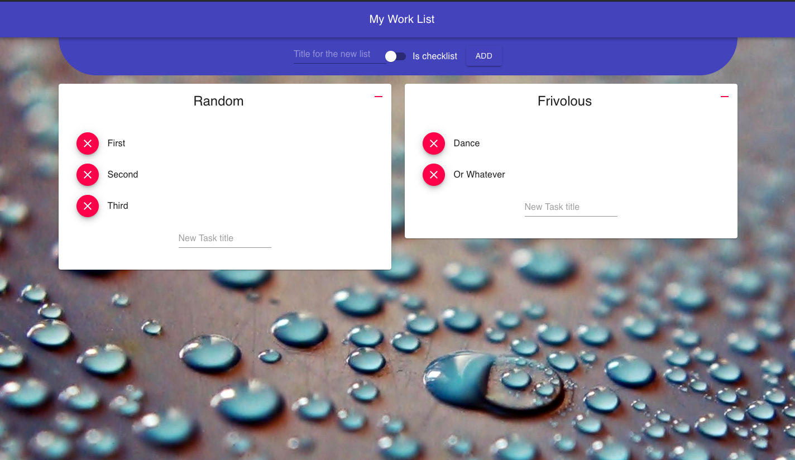

# Worklist
### Simple tasks lists in your new tabs in chrome, so that you'll never forget!!

### Installation

> `yarn`

> `yarn build`

#### Naviagate to chrome://extensions and click load unpacked, giving the path of the build directory

### Screenshots

