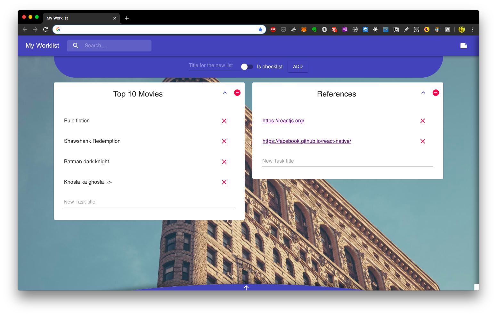
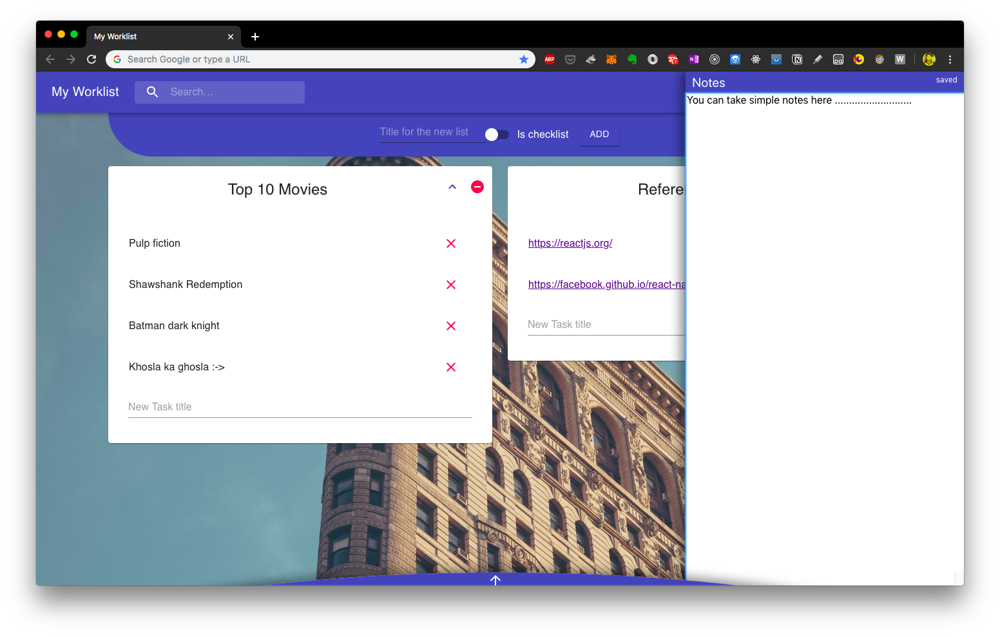
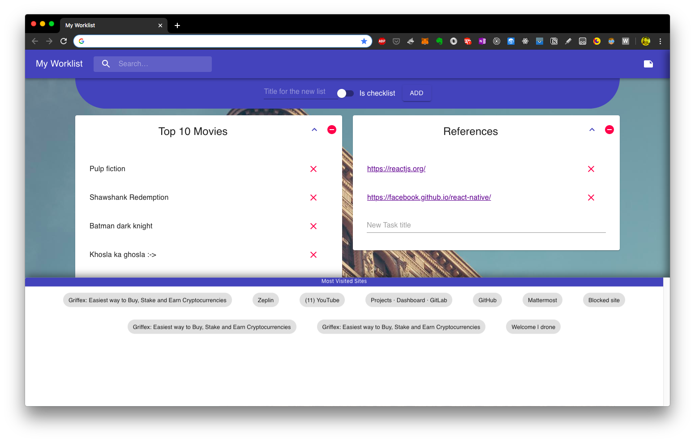

# Worklist
### Simple tasks lists in your new tabs in chrome, so that you'll never forget!!

### Installation

> `yarn`

> `yarn build`

#### Naviagate to chrome://extensions and click load unpacked, giving the path of the build directory

### Screenshots

#### Changelog 
 * Added support for checklists 
 * Added dynamic backgrounds
 * Added support tasks as a url
 * Added simple notes at right of the window
 * Added view to show links to most used sites
 * User can now expand and shrink lists
 * Searching for lists

